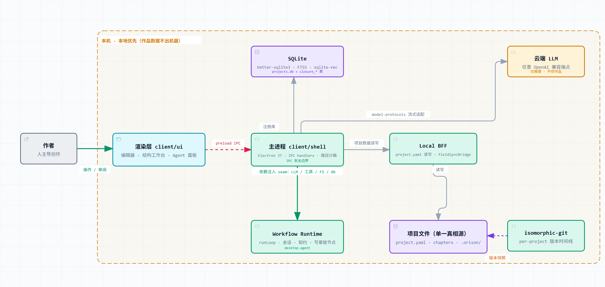
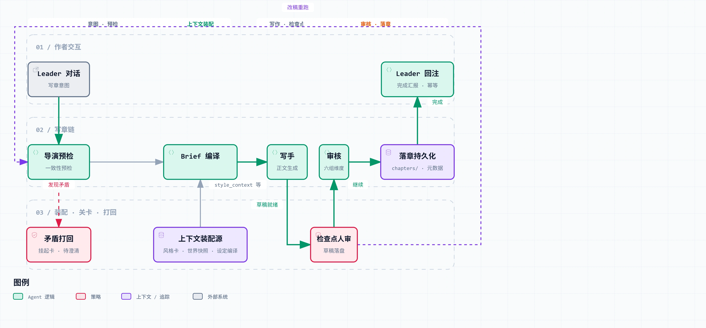
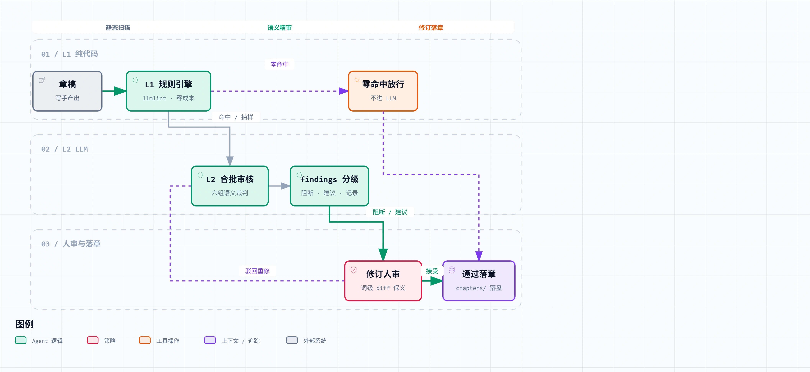

<div align="center">


# Closure

> Open-source, local-first AI novel-writing IDE.

[中文](README.md)

[](LICENSE)
[](https://github.com/LumenStorm/OrisonSpace)


**⬇ [Download](../../releases/latest)** · [📖 Docs](docs/) · [🕒 Timeline Guide](docs/guides/时间线指南.md) · [📋 Changelog](CHANGELOG.md)

</div>

---

> 📌 **This is Closure** — a fork of [OrisonSpace](https://github.com/LumenStorm/OrisonSpace) (Apache-2.0). On top of OrisonSpace's local-first AI writing IDE, Closure adds its narrative operating system layer: structured state machines (CognitionGraph / desire vectors / world entries / information-gap state machines / narrative dependency graphs), a structured knowledge base with hybrid retrieval (a deterministic pure-code core), and original modules such as information-gap control, emotion loops, the desire engine, theme gravity fields, and ripple propagation.
>
> Closure as a whole is released under **AGPL-3.0-or-later**; code derived from OrisonSpace retains Apache-2.0. For attribution and provenance, see [NOTICE](NOTICE).

---

<!-- Screenshot placeholder: run pnpm dev and capture the workspace page; should show project management + chapter editing + AI assistance -->
<!--  -->

---

**Closure** is an open-source, local-first AI novel-writing IDE for web-novel and long-form fiction authors, bringing outlines, chapters, characters, and worldbuilding asset cards into one workspace. Its principle is "you lead the creativity; the AI writes and self-checks": AI generation, continuation, polishing, review, and controlled edits, connected to any OpenAI-compatible model — with all creative data kept on your own computer. Windows is the priority platform; macOS / Linux are inherited from the upstream architecture. Closure is open source under AGPL-3.0-or-later (code derived from OrisonSpace retains Apache-2.0).

## Why Build Closure

**Our stance first: creative writing is, in the end, human work.**

Feeding in one sentence and having an AI generate an entire novel only produces garbage — we don't build that product, and we explicitly don't serve users who want it.

Closure is for people who **have ideas, imagination, and the ability to think, but not necessarily the ability to write**. You want to try writing a novel but lack the time, the energy, or the confidence in your own prose — that's fine. You supply the creativity and the judgment; Closure supplies the prose and the engineering. Throughout the system, conceiving, weighing, and deciding are always yours; gap-finding, continuation, revision, and self-review are its.

This project started from two observations:

1. **Existing AI writing tools all "generate first, patch afterwards."** They are essentially autoregressive generation plus style patches: the AI first writes text that reads AI-written, then rules, word lists, and rewrites are applied to fix it. None of them actually model the writing mind — the author's information-gap control while plotting, emotional-arc design, the evolution of character desire, million-word long-range consistency. In our research, 67% of writers never use AI writing tools, and the most concentrated reason is "what the AI writes doesn't read human, and fixing it takes more effort than writing it myself."
2. **Fanfic authors can't find a fitting tool.** Writing fan fiction requires fully understanding the original work (worldview, themes, tone, and character portrayals together with community consensus), controlled deviation rather than random drift, and dynamic "no OOC" gatekeeping — no tool on the market natively supports any of this.

Closure's answer: let the AI, like a human author, first **operate** on structured narrative state (who knows what, where the emotion has traveled, where desire points) — and only then write the prose — instead of generating first and patching afterwards. The writing mind is engineered into the system, not bolted on as an afterthought.

If all goes well, a couple of years from now the picture looks like this: an author uses Closure to write a long novel or fanfic with no character breaks, intricate information gaps, deliberately shaped emotional rises and falls, and a million words that never fall apart — and the whole creative process feels like directing an AI collaboration, not mopping up slop.

## Where the Name Comes From

Closure (可露希尔) is an operator in *Arknights*, the engineering systems lead of Rhodes Island.

When this project started, there wasn't a single writing tool on the market that was genuinely friendly to fanfic creation — and we happened to want to write Arknights fanfic; that stretch also coincided with the game's seventh anniversary and Closure's banner being up, so we went with the flow and gave the project her name. Fanfic creation support is on the [roadmap](#roadmap); we will come back for it.

## Core Principles

- **Make the AI think like a human author** — the theoretical foundation of story engineering is Aristotle's four causes (material × formal × efficient → final): settings are the material, structure is the form, character desire is the efficient cause, theme is the final cause. Closure engineers this writing mind layer by layer.
- **The AI writes; you direct** — the AI executes your ideas: building structure, generating prose, self-checking quality; you provide key guidance, inject inspiration, and make the final calls. Every AI edit is previewable, comparable, and revertible.
- **Quality first, honestly open source** — quality first, then model routing to control cost; never saving money by skipping review or degrading quality. No specific model recommendations, no commercial detectors, no monetization — fully open source under AGPL-3.0.

## Feature Highlights

### The Closure Layer: Narrative Engineering

On top of OrisonSpace's writing-IDE base, Closure rebuilt the generation pipeline around "letting the AI manipulate information gaps, emotion, and desire like a human author":

- **Multi-thread narrative structure** — one scene graph manages the story skeleton; multiple storylines advance in parallel and interlock
- **Structure workbench** — a single structure page overviewing the whole book: causal skeleton and arrangement workbench, two linked zones; the chapter axis is banded by volume and a minimap supports long-form navigation; emotion and pacing curves can be toggled on as overlays over the structure graph (foreshadowing overlay planned); **isomorphic lockstep** — select an element in either zone and the associated cards highlight in sync, so tracing one thread across zones takes no flipping back and forth
- **Information-gap control** — records what each character knows and what the reader knows. Review catches holes like "a character said something they couldn't know" or "a planted foreshadow was never revealed," while the author's deliberate concealments and delays are not false-flagged
- **World-event system** — after each chapter is written, five kinds of changes (physical, cognitive, emotional, relational, factional) are extracted from the prose and merged into world-state snapshots that advance with the plot. The key is that the ledgers come in two layers: **factual truth** and **what the reader knows right now** are recorded separately — the gap between them is your foreshadow inventory; what should have been planted but wasn't, what should have been revealed but wasn't, the system can see. When a later chapter starts, who knows what right now and where each relationship stands enters the writer's context automatically
- **Engineered emotion loop** — set the target emotion for a scene before writing it; once written, automatically check whether the emotion actually landed, and bounce it back for revision if it didn't
- **Write-chapter chain** — the full flow of writing one chapter: intent is dialogued, the director checks settings, context is assembled, the writer drafts, a checkpoint pauses for your review, review and revision run, and after the chapter lands it comes back to report. Every step pauses for a human; the steering wheel stays in your hands
- **Two-layer orchestration architecture** — the strategic layer is the commander in the dialog (you in the loop, redirecting anytime); the tactical layer is a node chain with explicit contracts (dependencies never dropped, artifact flow never relies on prompts implicitly carrying it); chain segments bring only summaries back to the dialog — internal process never eats your context; checkpoints can pause, resume, and rerun after edits
- **Two-phase writer drafting** — the writer doesn't generate in one breath: it first self-checks for context gaps, lists an investigation checklist, and only starts writing after the researcher verifies every item. When the context budget runs out, pruning follows a degradation ladder — the story skeleton, the full-book table of contents, and queryable pointers are never pruned
- **Web research** — check sources before writing: multiple search providers configurable (Tavily / Bocha / AnySearch; keys stored locally only). The researcher searches, the director verifies — anything contradicting existing settings gets bounced back for you to clarify, and research results settle into the workbench as cards. Useful for checking canon when writing fanfic, or industry details when writing urban fiction
- **Meaning-preserving revision** — every AI edit is presented as a word-level diff: what changed, and whether the original meaning drifted — verifiable at a glance
- **Never lost at a million words** — chapter summaries, integrity checks, and mention ledgers; even at a million words, it still remembers who said what in which chapter
- **Ripple propagation** — changed a setting in chapter 3? The system traces forward along the narrative dependency graph and automatically marks which downstream chapters and threads are affected and what kind of impact it is — the bill for changing settings never goes unrecorded
- **De-AI-flavor** — embeds the [llmlint](https://github.com/notnotype/llmlint) static engine: hundreds of rules scanning purely locally at zero cost to catch "AI tone"; paired with the Lint panel and the revision loop to clear findings one by one
- **Style cards** — paste a passage from a novel you admire, and a sub-agent analyzes it into a style card stored in the project (with the original excerpt); the writer, refiner, and planner all reference it afterwards. Without a style card, everything works as usual
- **Craft knowledge base (craft KB)** — a built-in knowledge base of writing methodology: craft entries, source anchoring, grouping by topic; the writer, director, and reviewer can all consult and cite it; seed content ships with the app, and you can extend it yourself
- **Two-layer review** — free pure-code rules run first; drafts with zero findings pass straight through; only flagged drafts go to the model for detailed review (six groups: consistency, narrative features, promise fulfillment, cognitive state, emotion landing, setting contracts). Two disciplines: **every finding must cite the original text** — no evidence, no opinion; and **false positives are preferred over misses** — the review layer is never allowed a "fake pass"
- **Tiered model routing** — planning, prose writing, review, research, style analysis, and every other stage can each be assigned a different model and tier: the strongest model for prose, cheap models for chores; each stage's thinking depth (reasoning effort) is also individually adjustable — cost goes where it counts
- **Creative decision records** — major creative choices are archived like architecture decision records (why it was decided this way, what the alternatives were); review uses them to check whether later chapters betray the promises you made

### Base Capabilities (Inherited from OrisonSpace)

- **Full-pipeline creation workspace** — outlines, chapters, and character & worldbuilding asset cards in one workspace
- **Local-first** — works are saved as plain files on your own computer; no account needed
- **Image generation + editing** — text-to-image, image editing (brush/mask/crop); results go straight into the library
- **Version control** — isomorphic-git-based commit nodes, branches, diffs, and timeline
- **IDE-style editor** — split view, minimap, multi-tab, command palette
- **Model freedom** — connect any OpenAI-compatible endpoint; keys stored encrypted, locally only

> **Experimental features:** Agent Orchestration (multi-step pipelines), Auto Mode (auto-advance), and video generation are currently experimental and not guaranteed to be stable.

## Who It's For

- **People with a story to tell but short on time or prose** — you have ideas, imagination, and judgment, just not the time and energy — or the confidence in your own prose. You bring the creativity and the decisions; Closure brings the execution and the engineering
- **Quality-first web-novel / long-form fiction authors** — who need outlines, chapters, and character settings to accumulate long-term in one workspace, and want an AI that thinks like a human author, not one that guesses the next token
- **Fanfic authors (coming soon)** — the fanfic pipeline with original-work understanding, anchors, and OOC prevention is on the roadmap; it is one of this project's founding motivations
- **Creators who want AI without handing over the wheel** — Closure is a creative workbench, not a one-shot generator: every AI edit is previewable, controllable, and revertible
- **People who value privacy and data ownership** — works are saved entirely as local files, never uploaded, no account required; bring any OpenAI-compatible API key

**Explicitly not served:** users who want to type one sentence and get a whole novel, caring about output volume over quality — creative writing is human work in the end, and with Closure this need will only disappoint both sides.

## Tech Stack

| Layer | Technology |
|-------|------------|
| Desktop | Electron |
| Frontend | React · TypeScript · Zustand · TipTap |
| Agent | Custom Workflow Runtime (embedded library) |
| Model Protocol | Unified OpenAI-compatible adapter (AI SDK) |
| Build | pnpm monorepo · Turbo · Vite · Vitest |

## The Structure Page: One Cockpit for the Whole Book


The structure page is Closure's cockpit. The causal skeleton and the arrangement workbench, two linked zones: watch the causal threads of your storylines on one side while arranging scene cards by chapter on the other; the chapter axis is banded by volume, and the minimap supports navigation for hundred-chapter long forms; cards pack densely across the canvas — information density maxed out without crowding. The most convenient part is **isomorphic lockstep**: select an element in either zone and the associated cards highlight in sync — tracing a thread's whole story takes no flipping back and forth. When you change a setting, ripple markers tell you directly which downstream chapters are implicated.

## Architecture Overview

Three interactive architecture diagrams (zoomable / theme-switchable / guided views) live in [`docs/diagrams/`](docs/diagrams/):

### [Overall Architecture](docs/diagrams/closure-architecture.html)



Your work is just plain files in a local folder (outline, chapters, settings) with git-style version history; the database is only an auxiliary index — delete it and it can be rebuilt. AI capabilities (models, tools, file access) are all injected into the orchestration layer by the main process; cloud models only receive inference requests and never see your drafts.

### [The Write-Chapter Chain, End to End](docs/diagrams/write-chapter-chain.html)



The route of writing one chapter from start to finish: the director checks settings first and bounces back contradictions; then context is assembled (settings, world state, style card); the writer drafts and the draft is saved to disk immediately; it pauses for your review, then goes through six-group review and word-level revision; after the chapter lands, it returns to the dialog to report to you.

### [The Two-Layer Review Funnel](docs/diagrams/review-funnel.html)



Free local rules run first; drafts with no problems pass straight through; only flagged drafts go to the model for detailed review. Findings are graded into three levels (must handle / should handle / for reference); revisions are presented as word-level diffs and decided by you; rejections can go back through review again.

## Repository Structure

```
apps/
  desktop/
    agent/          — @orison/desktop-agent (orchestration library)
    client/
      shell/        — Electron main process + preload
      ui/           — React renderer
    local-bff/      — local project data layer
packages/
  model-protocols/  — model protocol adapters (pure Node)
  shared-contracts/ — cross-process type contracts (Zod schemas)
  story-sync/       — Story Sync extraction & patch logic
docs/               — architecture & design docs
```

## Download & Install

> ⚠️ The project is still in **early development**; you may run into all kinds of weird bugs — if you do, please [open an issue](../../issues); see [Project Status](#project-status).

Download installers from [GitHub Releases](../../releases):

| Platform | Format |
|----------|--------|
| Windows | `.exe` installer / portable `.zip` |
| macOS | `.dmg` disk image (experimental; uploads coming in batches) |
| Linux | `.AppImage` portable executable (experimental; uploads coming in batches) |

## User Guide

- [Timeline · Version Management Guide](docs/guides/时间线指南.md) (Chinese) — save time nodes, branch out, and return to old versions

## Roadmap

### Narrative Core

- [x] Multi-thread narrative structure
- [x] Setting layer (asset cards, genre contract, creative decision records)
- [x] Structure workbench
- [x] Generation quality chain
- [x] Emotion loop
- [x] Information-gap control
- [x] Meaning-preserving revision
- [x] Million-word long-range supply

### Cross-Cutting Capabilities

- [x] World-event system (data layer and extraction chain)
- [x] De-AI-flavor engine
- [x] Two-layer review funnel
- [x] Task-based model routing and thinking controls
- [x] Style cards and style-passage dialog

### In Progress

- [ ] Full-pipeline field testing in real creative work (second round of realistic chapters wrapping up)
- [ ] World-event data viewer UI

### Planned

- [ ] Book-deconstruction engine: universal ingestion, experience-doc pipeline, novel teardown, online ecosystem
- [ ] Craft assistance engine (engineering the craft methodology)
- [ ] Structured knowledge base + hybrid retrieval (design finalized: FTS5 + vectors + rerank)
- [ ] Full style learning (statistical-fingerprint interaction, style refinement, multi-POV voice comparison)
- [ ] Style-consistency dimension for review
- [ ] Foreshadowing visualization panel (foreshadow registry, review, and tracking chain are ready; the structure-page overlay and management UI are next)
- [ ] Worldline system
- [ ] Character-card visualization (relationship graph, character radar, and other graphical views)
- [ ] Custom wallpaper (app background image + adjustable mask opacity)
- [ ] Fanfic creation pipeline (full original-work understanding, character portrayals, anchors, controlled deviation, OOC review) — one of this project's founding motivations; it will be done
- [ ] Existing-work import / export enhancements / usage statistics

## Project Status

> ⚠️ **Early development stage (Alpha)** — Closure is still iterating fast; features and UI may change, and you may hit all kinds of weird bugs: broken layouts, interrupted generation, odd data behavior, or stranger things. **If you hit a problem, please [open an issue](../../issues)** with reproduction steps, your OS, and the app version (visible in Settings → About) — we read every single one.

The core narrative chain (structure → settings → chapter writing → review → revision → long-range supply) is complete and field-tested in real creative work. **Windows is the priority release platform**; macOS / Linux are inherited from the upstream architecture and not yet thoroughly tested.

## FAQ

**What is Closure?**
An open-source, local-first AI novel-writing IDE that brings outlines, chapters, characters, and worldbuilding asset cards into one workspace, with AI generation, continuation, polishing, review, and controlled edits.

**How is it different from a chat tool like ChatGPT?**
It's a workbench for long-form writing, not a one-shot generator. Project structure, a version timeline, and an asset library accumulate over time; every AI edit is previewable, controllable, and revertible, and the user always leads the creation.

**Is my work uploaded to the cloud?**
No. Closure is local-first: your work is saved as plain files (`project.yaml`, `chapters/*.md`, etc.) on your own computer — no account required, and data never leaves your machine.

**Which AI models are supported?**
Any OpenAI-compatible endpoint. You connect with your own API key and freely choose text and image models; keys are stored encrypted, locally only.

**Which operating systems are supported?**
Windows, macOS (Intel and Apple Silicon), and Linux.

**Is it free? Is it open source?**
Fully open source under AGPL-3.0-or-later (code derived from OrisonSpace retains Apache-2.0) and free to use. You only cover your own model API usage.

## Third-Party Components & Acknowledgements

- **[OrisonSpace](https://github.com/LumenStorm/OrisonSpace)** (Apache-2.0) — Closure's code base: the IDE shell, agent runtime, skill compiler VM, database layer, and editor all originate from that project. Provenance in [NOTICE](NOTICE).
- **[llmlint](https://github.com/notnotype/llmlint)** (AGPL-3.0-only, © 2026 notnotype) — the de-AI-flavor static analysis engine. The upstream package is not published to npm (the `llmlint` package name is taken by an unrelated project), so its `skill/` subset is vendored in (commit `7b0e5a0`, 2026-08-15) at `apps/desktop/agent/src/lint/vendor/llmlint/`; the engine source and rule library remain byte-identical with upstream. The modification list is in that directory's README and [NOTICE](NOTICE).

## License

[AGPL-3.0-or-later](LICENSE). Closure as a whole is released under AGPL-3.0-or-later; code derived from OrisonSpace retains Apache-2.0 (see [LICENSES/Apache-2.0.txt](LICENSES/Apache-2.0.txt)). For attribution and provenance, see [NOTICE](NOTICE).

## Community & Links

- QQ group: **1106823246** (bug reports, usage discussion, and urging us along the roadmap)
- [LinuxDO](https://linux.do/)

## Contributing

Issues and Pull Requests are welcome. Please read the [Contributing Guide](CONTRIBUTING.md) first.

- Bug reports: please include reproduction steps and system info
- Feature suggestions: please open an issue for discussion first
- Security issues: please use private disclosure — see [SECURITY.md](SECURITY.md)
